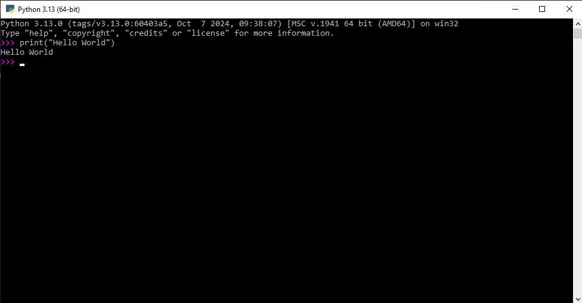
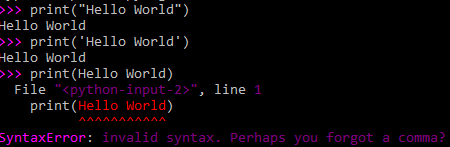
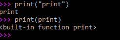

# Hello World

Nosso primeiro objetivo, é conseguir alcançar o seu primeiro "Hello World", que costuma ser o primeiro passo nos estudos de programação.

> O "Hello World" não tem nada de complicado que você precise entender, trata-se de exibir a mensagem "Hello World" em algum lugar, utilizando os recursos que a linguagem em questão nos disponibiliza. Em Python, por exemplo, poderemos fazer isso na linha de comando!

## Instação

<!-- [texto](link) -->

Para instalar o Python, basta acessar o [link do site oficial](https://www.python.org/) que no momento em que estou escrevendo isso, se parece com isso aqui:


Depois disso, você vai até a parte de [downloads](https://www.python.org/downloads/) que se parece atualmente com isso:


E então é só baixar a versão correta para o seu sistema operacional.

Quanto a configurações específicas durante o download você provavelmente não deve se preocupar com nada por enquanto.

Se tiver alguma dúvida extra, [esse vídeo](https://youtu.be/VuKvR1J2LQE?si=44g-r0C-GIOEzx4r) do canal Curso em Vídeo sobre instalação do Python pode te ajudar.

Com leves diferenças por conta das atualizações, mas ao final da instalação você vai ter esses 4 atalhos


O "IDLE" é um ambiente onde você pode testar alguns comandos básicos. Acesse [esse link](https://docs.python.org/3/library/idle.html) para mais informações sobre o IDLE

Em "Python 3.13" você pode abrir um terminal com o Python já "rodando" em tempo real pra você poder fazer alguns testes rápidos caso necessário.

E esse é o mais importante por agora. Vamos para o "Hello World"

## A Primeira Linha de Código

O "Hello World" do Python se faz da seguinte forma:

```python
print("Hello World")
```

O resultado deve se parecer com isso:



Se você chegou até aqui, parabéns! Você acaba de executar o seu **primeiro comando** em Python!

Mas agora, vamos tentar entender o que está acontecendo aqui. Por mais simples que seja este comando, ele tem muito a nos ensinar!

### O que é `print`?

`print` é uma **função** do Python que exibe (imprime) algo no terminal, esse "algo" somos nós, programadores, que decidimos o que é.

> Experimente executar o comando novamente, mas agora coloque seu nome ou alguma mensagem engraçada no lugar do "Hello World", use a criatividade!

### Por que entre aspas? (")

Talvez você tenha tentado executar o comando sem colocar sua nova mensagem entre aspas, e sim, elas são importantes, então não se esqueça delas.

É possível usar aspas simples (`'`) ou duplas (`"`) para isso, escolha a que te agradar mais.



#### Tá, mas por que eu tenho que usá-las?

Assim como `print`, o Python tem outras **palavras reservadas** para funções da linguagem, além de poder usar palavras que **você** reservou para representar alguma informação (essa parte vai ficar mais clara quando falarmos de variáveis), e ele precisa conseguir diferenciar se você está falando da função de imprimir uma mensagem na tela `print` ou se você está falando da **palavra** "print". Em outras palavras, isso serve para diferenciar o que é "texto" de "nomes de coisas" (falando de forma bem informal).

Observe o exemplo abaixo:



Primeiro eu pedi para o Python mostrar na tela a **palavra** "print", o resultado foi "print", como o esperado.

Depois, eu pedi para ele imprimir o **valor** atribuído ao **nome** print, e ele nos disse que é uma função.

Caso não tenha ficado claro a diferença e importância das aspas, no primeiro comando ele imprimiu o **texto** usando a função **nomeada** `print`, que imprime algo na tela. Já no segundo comando, ele imprimiu o **valor** associado ao **nome** `print`, que como acabamos de falar, é uma função, e foi isso que ele nos "respondeu".

### Por que os parênteses?

Lembra quando falamos que a função `print` imprime "algo" na tela? Ela recebe o "algo" através dos parênteses, e depois faz o que tem que fazer (imprimir na tela).

##  Atribuição de variáveis

Pense na atribuição de variáveis como "colocar coisas dentro de caixas".

Voltando ao exemplo da função `print`, em algum momento os desenvolvedores do Python decidiram colocar em uma caixinha chamada "print" um mecanismo que imprime algo no terminal.

> Essas "caixinhas com mecanismos dentro" são chamadas de funções, que serão mais exploradas futuramente.

Mas não são só mecanismos que podem ser "colocados dentro de caixas com nomes", valores (ou dados) também podem. A atribuição de variáveis (inserção de coisas em uma "caixa") se faz da seguinte forma em Python:

```python
nomeDaVariavel = "valor da variável"
nomeDaCaixa = 'valor dentro da caixa'
```

Note que `nomeDaVariavel` e `nomeDaCaixa` estão escritos **sem aspas** nem simples e nem duplas. Isso significa que estamos associando o "nome" `nomeDaVariavel` e `nomeDaCaixa` à valores.

Note também que os textos foram escritos entre aspas duplas e depois aspas simples. Eu fiz isso de propósito para demonstrar que isso é possível, desde que você use os mesmos para começar e terminar um mesmo texto.

O que está acontecendo aqui é que estamos associando `"valor da variável"` ao nome `nomeDaVariavel` e o mesmo acontece com `nomeDaCaixa`.

Agora, você se lembra do que aconteceu quando tentamos executar o seguinte comando?:

```python
print(print)
```

O Python nos disse que era uma função. Isso aconteceu porque o **nome** `print` está associado a uma função assim como o **nome** `nomeDaVariavel` foi associado a `"valor da variável"` no nosso exemplo anterior.

Experimente testar o seguinte código

```python
nomeDaVariavel = "valor da variável"
print(nomeDaVariavel) # Resultado: "valor da variável"
```

Note que o resultado foi o **valor** associado com o **nome** `nomeDaVariavel`.

### Valores das variávels

Os valores que nós associamos as variáveis podem ter diferentes tipos. Até então nós conhecemos os "textos" e as "funções", mas não existem só eles!

Agora vamos conhecer novos tipos de valores que podemos colocar nas nossas variáveis.

## Tipos primitivos de dados

Python tem 4 tipos primitivos principais:

- `String` para textos
- `Integer` para números **inteiros** (sem casas decimais)
- `Float` para números **reais** (que podem ter casas decimais)
- `Boolean` para valores Verdadeiros ou Falsos

Talvez você esteja ser perguntando onde estão a "funções" que vimos anteriormente, e é uma excelente pergunta! Funções não são um tipo de dado primitivo, mas sim o que o Python chama de "tipos chamáveis" (Callable types). Normalmente quando você escutar o termo "chamar" em programação, muito provavelmente estão falando de executar uma função, como fizemos com a função `print` anteriormente.

Vamos ver um pouco mais sobre os tipos de dados a seguir.

### String (str)
O tipo "string" é usado para representar textos, cadeias de caracteres, e normalmente são acompanhados de aspas simples ou duplas no começo e no final

```python
"Hello world"
'Hello world'
```

### Integer (Inteiro ou int)
O tipo "integer" é usado para representar números inteiros, como 0, -1, 10, 10000, 5000...

### Float
O tipo "float" é usado para representar números com casas decimais, como por exemplo 3.14, 10.5, 2.5, etc...
Um detalhe importante, diferente do que costumamos fazer na linguagem cotidiana ou durante cálculos matemáticos, em python os números com casas decimais separam a parte inteira da decimal usando um ponto (.) ao invés de uma vírgula (,).

### Boolean
O tipo "boolean" é usado para definir valores que são "True" ou "False".

## Operadores

Os operadores servem para executar operações entre dois dados (normalmente do mesmo tipo).

### Operadores matemáticos

Operadores que podem ser usados para fazer operações matemáticas, respeitando a ordem de precedência padrão da matemática.

#### Soma - "+"
```python
print(10 + 5) # Retorna 15
```

#### Subtração - "-"
```python
print(10 - 5) # Retorna 5
```

#### Multiplicação - "*"
```python
print(10 * 5) # Retorna 50
```

#### Divisão - "/"
```python
print(10 / 5) # Retorna 2
print(5 / 2) # Retorna 2.5
```

#### Divisão inteira - "//"
Esse operador matemático funciona de maneira similar ao apresentado anteriormente, porém ele ignora a parte decimal do resultado.
```python
print(10 / 5) # Retorna 2
print(5 / 2) # Retorna 2
```

#### Resto da Divisão - "%"
Esse operador retorna o resto da divisão de dois números.
```python
print(10 % 5) # Retorna 0
print(9 % 2) # Retorna 1
print(5 % 2) # Retorna 1
```

#### Potenciação - "**"
```python
print(2**2) # Retorna 4
print(2**4) # Retorna 16
print(2**10) # Retorna 1024)

# O primeiro número (lado esquerdo do operador) é a base, e o segundo (lado direitor do operador) é o valor do expoente.
```

### Operadores de comparação

#### Maior e menor - "> e <"
```python
print(5 < 10) # Retorna "True"
print(5 > 10) # Retorna "False"
print(5 < 5) # Retorna "False"
print(5 > 5) # Retorna "False"
```

#### Maior ou igual e menor ou igual - ">= e <="
```python
print(5 <= 10) # Retorna "True"
print(5 >= 10) # Retorna "False"
print(5 <= 5) # Retorna "True"
print(5 >= 5) # Retorna "True"
```

#### Igual e diferente - "== e !="
```python
print(5 == 10) # Retorna "False"
print(5 != 10) # Retorna "True"
print(5 == 5) # Retorna "True"
print(5 != 5) # Retorna "False"
```

#### Comparações com strings
O Python verifica a igualdade de caractéres através da tabela ASCII, que pode ser consultada [aqui](https://pt.wikipedia.org/wiki/ASCII) caso você queira.

##### Igualdade
```python
print("a" == "a") # Retorna "True"
print("a" != "a") # Retorna "False"
print("a" == "A") # Retorna "False"
```

##### Maior ou menor (Ordem dos caracteres)
Ordem utilizada: ABCDE...XYZabcde...xyz
```python
print("a" < "A") # Retorna "False"
print("A" < "a") # Retorna "True"
print("a" < "a") # Retorna "False"
print("A" > "a") # Retorna "False"
```

### Operadores de atribuição

Existem mais operadores de atribuição além do mostrado anteriormente (`=`).

#### Operadores de incremento - "+="
```python
a = 5
print(a) # Retorna 5
a = a + 5
print(a) # Retorna 10
a += 5 
print(a) # Retorna 15
```

#### Operadores de decremento - "-="
```python
a = 20
print(a) # Retorna 20
a = a - 5
print(a) # Retorna 15
a -= 5
print(a) # Retorna 10
```

### Operadores Lógicos

São operadores usados para implementar a lógica usada por portas lógicas. Isso pode parecer confuso agora mas eu te garanto que vai ficar claro em breve, então não se preocupe.

#### and ("e" lógico)
| Valor 1 | Valor 2 | Resultado |
| :---: | :---: | :---: |
| True | True | True |
| False | True | False |
| True | False | False |
| False | False | False |

#### or ("ou" lógico)
| Valor 1 | Valor 2 | Resultado |
| :---: | :---: | :---: |
| True | True | True |
| False | True | True |
| True | False | True |
| False | False | False |

#### not ("não" lógico)
```python
print(not True) # Retorna "False"
print(not False) # Retorna "True"
```

#### Ordem de precedência (alterável via parênteses)
- not
- and
- or

## E é isso!

Parabéns se você chegou até aqui, espero que tenha entendido e que tenha se interessado pelo assunto. Caso você tenha alguma pergunta pode me mandar por qualquer meio de contato no meu perfil.

Bons estudos!